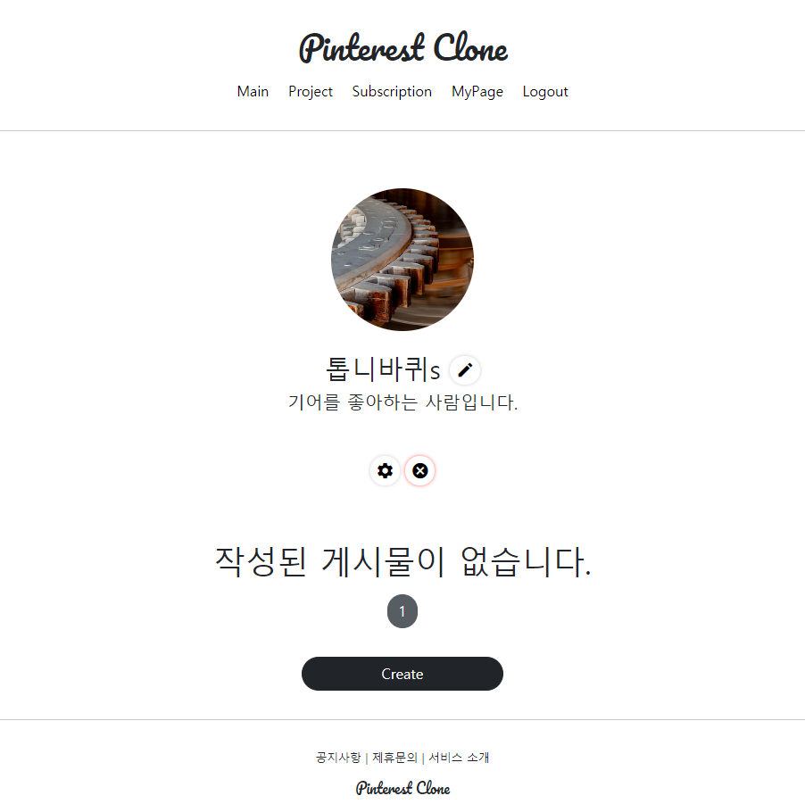
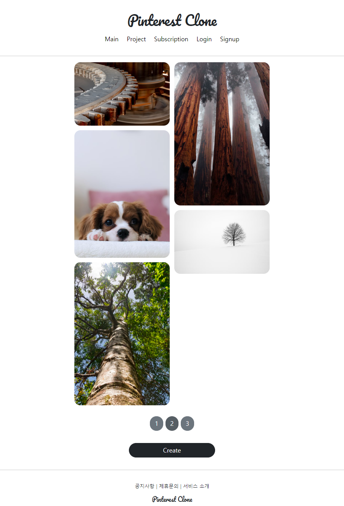
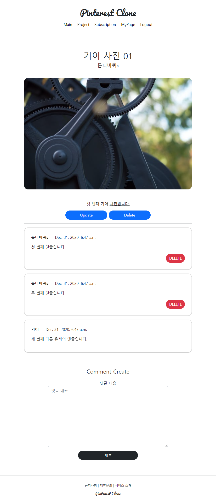
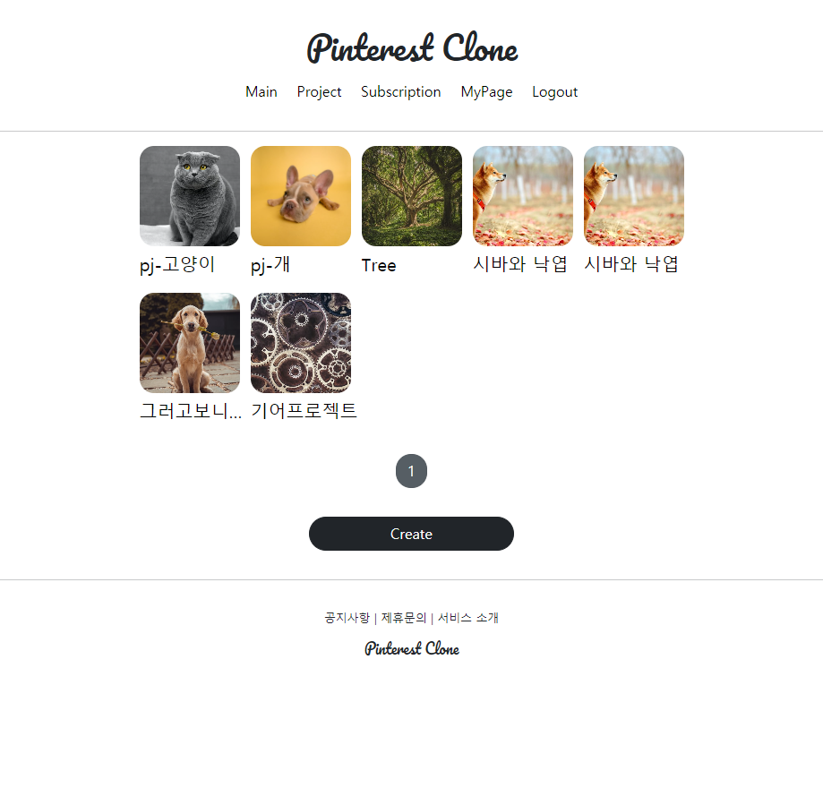
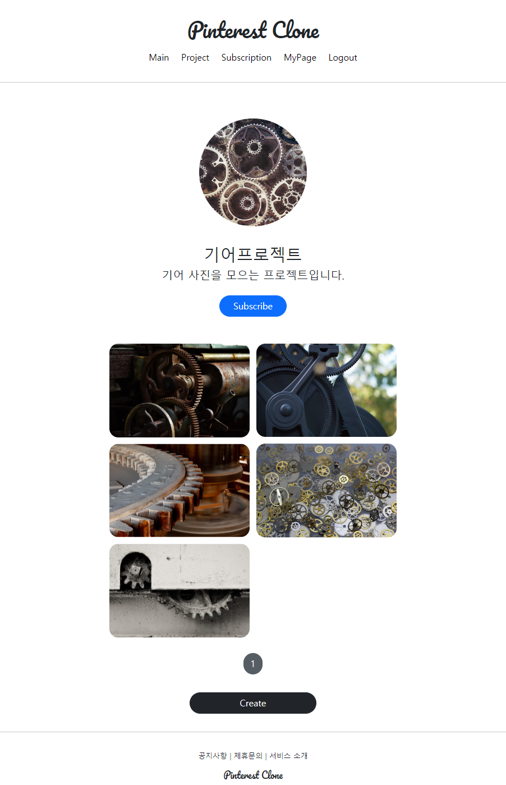

# Pinterest Clone

## 기간

- 2020.12.21 ~ 2020.12.31

## 목적

- Python 웹 프레임워크인 Django와 컨테이너 기술 Docker를 활용하여 웹 사이트 개발 및 서비스 배포까지의 **전반적인 흐름**을 파악하는 것을 위주로 진행하였다.

---

## 기술 스택

| 설명                    | 기술         |
| ----------------------- | ------------ |
| 웹 프레임워크           | **Django**   |
| Web Server              | Nginx        |
| WSGI                    | Gunicorn     |
| 컨테이너                | **Docker**   |
| 컨테이너 오케스트레이션 | Docker Swarm |
| 클라우드                | Vultr        |

---

## 개요

- 유투브 '**작정하고 장고**' 강의를 참고하여 Pinterest 사이트를 클론 해본다.
  - [작정하고 장고](https://www.youtube.com/watch?v=RWEZITw27Ts&list=PLQFurmxCuZ2RVfilzQB5rCGWuODBf4Qjo) (유료화 선언으로 링크가 제거될 수 있음)
- [클론 사이트 (간헐적으로 열릴 예정)](http://158.247.213.52/)

---

## 사이트 이미지

- 개인 프로필

- 게시물 목록

- 단일 게시물

- 프로젝트 목록

- 단일 프로젝트

---

## 후기

- **"웹 사이트 개발 및 서비스 배포까지의 전반적인 흐름을 파악"** 하는 것이 목적이었으며, 이를 충분히 만족하였다.
  - 전체적인 아키텍처와 흐름을 알고서 학습하는 것과 그것을 모르면서 따라가는 학습간의 효율은 극과 극이라는 것을 몸소 체험한 뒤로 이러한 선 체험 후 학습 방법을 추구하게 되었다.
- 앞으로 무엇을 배워나가야 하는지 알게 된 시간이었다.
  - Back-end
    - **Django REST Framework**를 학습하여 백엔드를 구현하고, Swagger 등을 통해 API 문서 생성의 자동화를 구현해본다.
    - Nginx, Gunicorn 등의 설정을 다루는 방법을 학습한다.
    - Database의 더 깊은 학습을 위해 책을 구매해야겠다.
  - Front-end
    - HTML, CSS, JS를 더 깊게 학습한다.
    - **React** 프레임워크를 학습해본다.
  - DevOps
    - CI/CD를 원할히 수행할 수 있도록 **Docker**를 전반적으로 학습한다.
- Docker의 위력을 알게 되었다. 개발 환경과 배포 환경을 동일하게 구성한다는 것과 컨테이너를 단위로 서비스를 제공한다는 것이 얼마나 효율적인 아키텍처인지 알게 되었다.

---
